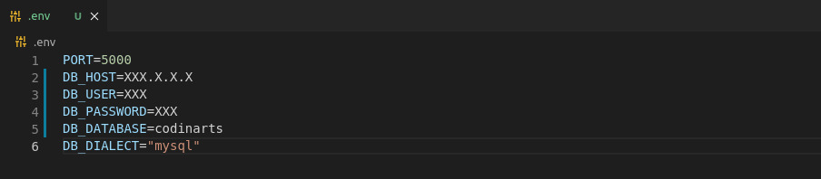

# codinarts-api
Bem-vindo(a) ao sistema de cadastro de clientes

### Features

- [x] Crud de usuário
- [x] Crud de Contatos
- [x] Crud de Endereços
- [x] Crud de Inquilinos
- [x] Relatórios

## Para iniciar, siga as instruções abaixo:

#### 1. Cire e configure arquivo .env:

<h1 align="center">
  
</h1>

#### 2. Instalação:
```
$ npm install
```
#### 3. Iniciar:
```
$ npm start
```


## Ferramentas

1. cors
2. dotenv
3. express
4. mysql2
5. nodemon
6. sequelize
